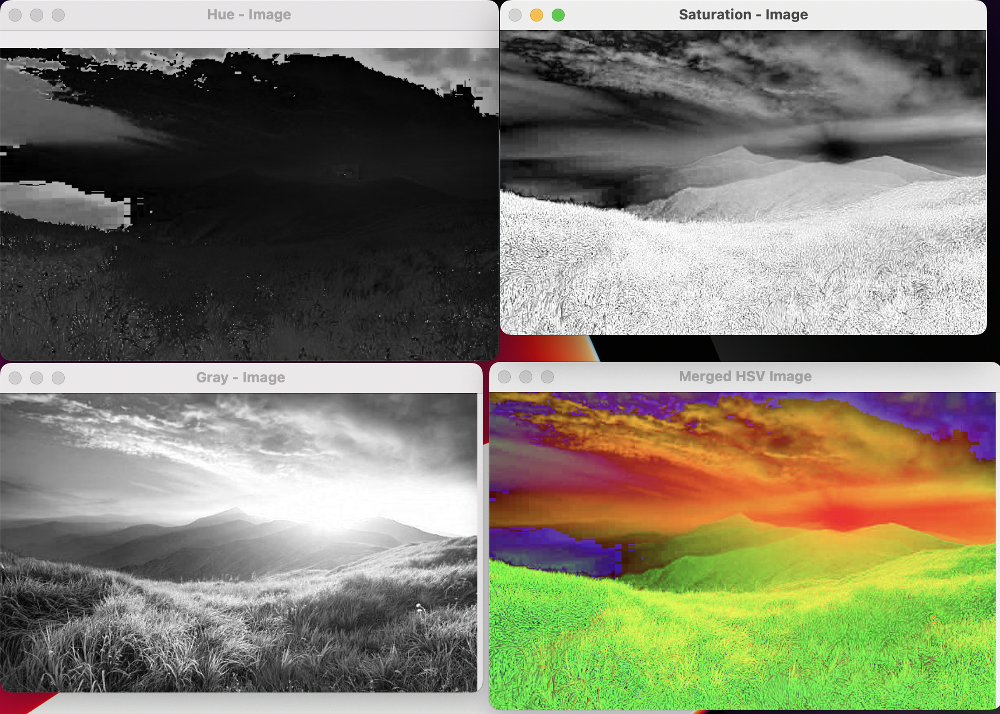

# Color Conversion
## AIM
To perform the color conversion between RGB, BGR, HSV, and YCbCr color models.

## Software Required:
Anaconda - Python 3.7
## Algorithm:
### Step1:
import opencv.

### Step2:
Read the original Image.
### Step3:
Store the required conversion of the image in a variable.
### Step4:
Show the image stored in the given variable.
### Step5:
Destroy all the windows and end the program.
## Program:
```python
# Developed By:
# Register Number:
# Developed By:Koduru Sanath Kumar Reddy
# Register Number:212221240024
# i) Convert BGR and RGB to HSV and GRAY
import cv2
houseImage = cv2.imread('house.jpg')
cv2.imshow('Original Image',houseImage)
hsvImage = cv2.cvtColor(houseImage,cv2.COLOR_BGR2HSV)
cv2.imshow('BGR2HSV',hsvImage)
hsvImage1=cv2.cvtColor(houseImage,cv2.COLOR_RGB2HSV)
cv2.imshow('RGB2HSV',hsvImage1)
grayImage = cv2.cvtColor(houseImage,cv2.COLOR_BGR2GRAY)
cv2.imshow('BGR2GRAY',grayImage)
grayImage1 = cv2.cvtColor(houseImage,cv2.COLOR_RGB2GRAY)
cv2.imshow('RGB2GRAY',grayImage1)
cv2.waitKey(0)
cv2.destroyAllWindows()


# ii)Convert HSV to RGB and BGR
import cv2
houseHSVImage = cv2.imread('house.jpg')
cv2.imshow('Original HSV Image',houseHSVImage)
RGBImage = cv2.cvtColor(houseHSVImage,cv2.COLOR_HSV2RGB)
cv2.imshow('BGR2HSV',RGBImage)
BGRImage=cv2.cvtColor(houseHSVImage,cv2.COLOR_HSV2BGR)
cv2.imshow('RGB2HSV',BGRImage)
cv2.waitKey(0)
cv2.destroyAllWindows()


# iii)Convert RGB and BGR to YCrCb
import cv2
houseImage = cv2.imread('house.jpg')
cv2.imshow('Original HSV Image',houseImage)
YCrCb_image = cv2.cvtColor(houseImage, cv2.COLOR_RGB2YCrCb)
cv2.imshow('BGR2HSV',YCrCb_image)
YCrCb_image1 = cv2.cvtColor(houseImage, cv2.COLOR_BGR2YCrCb)
cv2.imshow('RGB2HSV',YCrCb_image1)
cv2.waitKey(0)
cv2.destroyAllWindows()


# iv)Split and Merge RGB Image

import cv2
image = cv2.imread('house.jpg')
blue = image[:,:,0]
green = image[:,:,1]
red = image[:,:,2]
cv2.imshow('B-Channel',blue)
cv2.imshow('G-Channel',green)
cv2.imshow('R-Channel',red)
mergeBgr = cv2.merge((blue,green,red))
cv2.imshow('Merged BGR image',mergeBgr)
cv2.waitKey(0)
cv2.destroyAllWindows()


# v) Split and merge HSV Image

import cv2
image = cv2.imread('house.jpg')
hsv = cv2.cvtColor(image,cv2.COLOR_BGR2HSV)
h,s,v = cv2.split(hsv)
cv2.imshow('Hue - Image',h)
cv2.imshow('Saturation - Image',s)
cv2.imshow('Gray - Image',v)
mergedHSV = cv2.merge((h,s,v))
cv2.imshow('Merged HSV Image',mergedHSV)
cv2.waitKey(0)
cv2.destroyAllWindow

```
## Output:
### i) BGR and RGB to HSV and GRAY

### ii) HSV to RGB and BGR

### iii) RGB and BGR to YCrCb


### iv) Split and merge RGB Image

### v) Split and merge HSV Image


## Result:
Thus the color conversion was performed between RGB, HSV and YCbCr color models.
